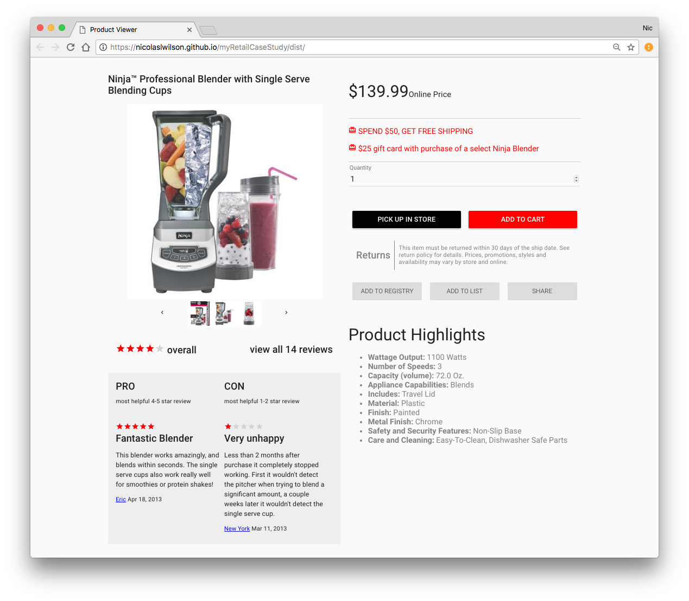

# myRetail Case Study

The task for this case study was to create a responsive user interface populated with item data from a .json file.

### Preview




## Getting Started

The project can be viewed live [here](https://nicolaslwilson.github.io/myRetailCaseStudy/dist/).

### Running Locally

To run the project locally:

1. Clone the repo to your local machine
2. Run `npm i` to install dependencies
3. Run `npm start` to start the Webpack Development Server
4. The project will open in your web browser at `localhost:8080`

### Testing

Although no testing is currently implemented, the testing frameworks have been setup. Running `npm test:watch` will run tests each time a file in the project is updated. This command is also run as part of `npm start`.

### Continuous Delivery

For this project I ran my tests and linter locally. GitHub was used to handle version control. A tool such as Travis-CI could be used to monitor commits to the repository and accept or reject builds.

```
Local Repo 
	┗ GitHub 
		┗ Travis-CI 
			┣ Tests Pass -> Production
			┗ Tests Fail -> Reject Commit
```
